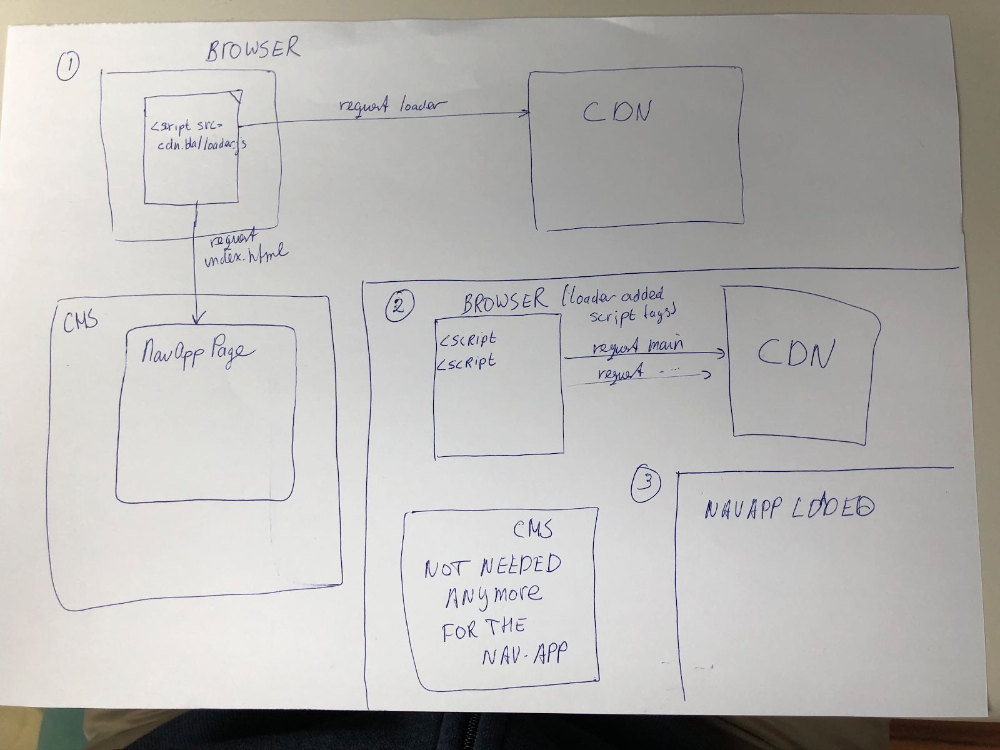

# Introduction

## Feature Context

_Unified Navigation_ brings together the existing brXM and brSM UIs in a single, integrated UI, facilitating sensible navigation between brXM and brSM functionality. Unified Navigation depends on Single Sign-On (SSO) support in order to combine the brXM and brSM functionalities into a user-tailored navigational structure.

## Scope

This document focuses on the navigation application (_nav-app_) that will allow a user to navigate seamlessly between brXM and brSM views.

## Related Documentation

There is a list of relevant related documentation on [Confluence](https://docs.bloomreach.com/display/GE/Unified+Navigation). Relevant for the review is the [communication library](https://docs.google.com/document/d/1JN9Artd0jS4YHOh8TG82by1Xo8Ad93xr9Lthe6yyBLk/edit#)

## Relevance / Alignment with Company Strategy

Unified Navigation is part of the _Unified UI/UX_ initiative, which has the purpose of showing the potential of combining the brXM and brSM products in the BRX (a.k.a. “1+1=7”).

## Assumptions

The following functional assumptions have been guiding this design:

- _the nav-app_ is a publicly available\* client side application distributed by a CDN and as generic as possible, i.e. not brXM or brSM specific;
- SSO functionality is provided and authentication is established through Auth0 before bootstrapping the nav-app;

\*publicly available, as in everyone can see the code (it is open source) and can download the @bloomreach/navigation-application package from npm.

# Description

The main idea behind the design of the nav-app is flexibility, simplicity and isolation because it will be used in different use cases in different environments. The nav-app should not contain any hard coded links to endpoints which return navigation configuration, but it must be flexibly configurable instead.

## Possible use cases

The main commercial offering with the UUI nav-app, will be “BRX”, which is a combination of both of the main product lines at BloomReach, brXM, and brSM. The “BRX” use case will be the primary use-case for the application, however, just as important, are the secondary use-cases of utilising the new navigation in brXM or brSM in a standalone manner. Existing clients have different installations - some of them use _brXM_ only, some _brSM_ only, but they could potentially use both in future (as a BRX customer) which is reflected in the table below:

<table>
  <tr>
   <td>
   </td>
   <td>brXM
   </td>
   <td>brSM
   </td>
   <td>BRX
   </td>
   <td>Auth
   </td>
  </tr>
  <tr>
   <td>A
   </td>
   <td>+
   </td>
   <td>-
   </td>
   <td>-
   </td>
   <td>SSO or legacy log in
   </td>
  </tr>
  <tr>
   <td>B
   </td>
   <td>+
   </td>
   <td>+
   </td>
   <td>+
   </td>
   <td>SSO
   </td>
  </tr>
  <tr>
   <td>C
   </td>
   <td>-
   </td>
   <td>+
   </td>
   <td>-
   </td>
   <td>brSM SSO
   </td>
  </tr>
</table>

Nav-app must cover all three cases but the login part will differ depending on the installation. So it means for example that clients which use brSM only will still use [tools.bloomreach.com](https://tools.bloomreach.com/login/) for the login process, but after successful login\_ \_nav-app is shown.

## User’s perspective

From the user's perspective, nav-app should enable the brXM and brSM applications to work seamlessly and behave in total as a single application. After successful SSO/Legacy login, user is redirected to the main page and sees the BRX application which is schematically shown on Pic. 1.


Pic. 1 Schematically represented nav-app from the user’s perspective.

## Technical perspective

The _nav-app_ shows the menu which represents the combined multi level menu items for _brXM,_ _brSM_ and - potentially in the future - 3rd party applications. The menu items are fetched from one or more sources and dynamically combined inside the _nav-app_. The _nav-app_ acts as a supervisor for underlying applications which means that all cross application interactions and redirects must be managed by the _nav-app_.

The proposed architecture is based on the idea of [micro-frontends](https://micro-frontends.org/). A micro frontend architecture allows for different parts of the UI to be developed independently while at the same time allowing interaction and UX flow through the application.

To achieve the micro-frontend architecture in _BRX_, we will use iframes to separate the _brXM_ and _brSM_ applications. The self-contained applications rendered in those iframes will be able to communicate and share data/state via the parent window. To route to, communicate from/to and share data/state among these child applications in iframes, a [communication library](https://docs.google.com/document/d/1JN9Artd0jS4YHOh8TG82by1Xo8Ad93xr9Lthe6yyBLk/edit?usp=sharing) will be created.

Parent window is the initial DOM that imports the nav-app. The nav-app will be responsible for rendering the brSM applications in iframes, alongside with the brXM Wicket application in an iframe. The existing brXM perspectives are then maintained by Wicket within its iframe, thus creating the second level of iframes within the wicket iframe for the channel manager, projects and any custom iframe perspectives.


Pic. 2 Schematically represented the nav-app from a technical point of view.

# Startup

Nav-app requires a global configuration object to provide the necessary information for startup. This global object contains user related information like name, language, timezone and resource-specific information to know what to load into iframes and how to retrieve menu items. The approximate shape of the global configuration object is following:

```
{
    "userSettings": {
        "userName": "Frank Zappa",
        "email": "frank.zappa@bloomreach.com",
        "language": "en",
        "timeZone": "Europe/Amsterdam"
    },
    "appSettings": {
        "basePath": "/base/path",
        "initialPath": "/some/initial/path",
        "navAppResourceLocation": [
            {
                "url": "https://cms.customer.com/api/nav-cfg/",
                "resourceType": "REST"
            },
            {
                "url": "https://tools.bloomreach.com/nav-cfg/",
                "resourceType": "IFRAME"
            },
		...
        ],
        "loginResources": [
            {
                "url": "https://domain.com/app/silent-login/",
                "resourceType": "IFRAME"
            },
        ],
        "logoutResources": [
            {
                "url": "https://domain.com/app/silent-logout/",
                "resourceType": "IFRAME"
            },
        ],
       "logLevel": "INFO"
    }
}
```

The global settings can be split into two main sections: **userSettings** and **appSettings**. So that **userSettings** contain all known information about the current user and **appSettings** contain information necessary for app startup and shutdown.

userSettings:

<table>
  <tr>
   <td>userName
   </td>
   <td>the full name of the user in the format: ‘{first name} {last name}’.
   </td>
  </tr>
  <tr>
   <td>email
   </td>
   <td>the email of the user
   </td>
  </tr>
  <tr>
   <td>language
   </td>
   <td>two letters language identifier
   </td>
  </tr>
  <tr>
   <td>timeZone
   </td>
   <td>user’s time zone (or the time zone user selected upon the login)
   </td>
  </tr>
</table>

appSettings:

<table>
  <tr>
   <td>basePath
   </td>
   <td>the base path of the app. The navapp uses this information to extract the iframe’s and app’s paths from the url
   </td>
  </tr>
  <tr>
   <td>initialPath
   </td>
   <td>Optional. If it’s set the navapp uses this value instead of the browser location’s url to do the initial navigation. If the value is not set or undefined or empty the navapp uses the browser location’s url. This value is set without the base path.
   </td>
  </tr>
  <tr>
   <td>navAppResourceLocation
   </td>
   <td>a list of navigation configuration resources that contains a list of sets of urls and resourceTypes (<strong>REST</strong>, <strong>IFRAME</strong> or <strong>INTERNAL_REST</strong>). The resource type determines how the nav-app will try to retrieve the configs. When nav-app has all menu items it’s able to initialise the app iframes
   </td>
  </tr>
  <tr>
   <td>loginResources
   </td>
   <td>array of resources that the navapp must call to perform a silent login. This is needed to put cookies required by the apps on the domains of the apps
   </td>
  </tr>
  <tr>
   <td>logoutResources
   </td>
   <td>array of resources that the navapp must call before actually logging out. This will give the apps the chance to cleanup app state before logging out
   </td>
  </tr>
  <tr>
   <td>logLevel
   </td>
   <td>The minimum log messages level. Log messages with the specified log level and higher priority will be logged other messages will be discarded. The value is specified as a string constant, available values are (sorted according to the priority from lowest to highest):
<p>
TRACE,
<p>
DEBUG,
<p>
INFO,
<p>
LOG,
<p>
WARN,
<p>
ERROR,
<p>
FATAL,
<p>
OFF
<p>
WARN level is used by default if this field is omitted.
   </td>
  </tr>
</table>

## The bootstrapping process

The transition process from the navapp initially loaded into the index.html to some reasonable content shown to a user is called the bootstrapping process. During that time navapp fetches necessary data, loads iframes and ensures that an app the browser navbar’s link points to is ready. It consists of the following steps:

1. fetching nav items from REST endpoints and/or iframes which are set in the configuration;
2. loading iframes (unique iframe urls are evaluated based on the fetched nav items) and establishing connections to client applications inside them;
3. displaying the menu with inactive (gray and/or faded) items next to the loading indicator;
4. activating menu items related to the connected iframe;
5. activating the current app (the browser navbar’s link points to) and showing the content to the user.

Steps 4 and 5 go in parallel so it means the current app may be loaded and shown first while the rest of the menu is still inactive awaiting for the related iframes to be loaded.

If the client application is connected all menu items related to that are activated. Additional granularity in activation of menu items is achievable through adding an optional **activatable** field to the NavItem type since menu items are directly bound to nav items. For applications exposing activatable nav items parent API **activate()** method is available. This method is mandatory to be invoked to declare which nav items are ready to be used so that related menu items can also be activated. The specification of this method is the following:

```
activate(paths: string[]): void
```

_paths_ - is a list of application’s paths the application wants to activate. These paths are used to find related nav items and finally menu items to activate.

# Structure

The navapp is written in Typescript and generated by Angular CLI. It consists of 3 main components: _Menu_, _Top Toolbar_ and _iframes manager_ which contains the brXM and brSM apps.

## Menus

Currently, brXM and brSM contain their own logic for generating the navigation menu links structure. In brSM, user specific access groups are used to filter a list of menu ids, which is then matched with the defined menu structure for actual rendering.

To achieve the common navigation, we will need to provide a navigation configuration to nav-app, and have each brXM/SM application pass in required information to control the rendering of menu items and process site selection.

The nav-app will contain two menus:

- The left menu
- The fast forward menu

Both menu structures are predefined in the nav-app. This structure will also define the initial expanded/collapsed state, menu icons, styling and ordering.

They will have leaves that initially do not have a baseUrl and path. Each app has to deliver a list of menu items that will refer to a leaf (by means of the menu item id). The nav-app will match the menu items with the leaves and set the baseUrl and path. All menu items that could not be matched with a leaf will be collected and marked as orphan (because they don’t have a parent). These orphans will be added under the parent “Extensions”.

After all menu items have been processed the nav-app will remove all leaves that do not have a baseUrl. In addition, parents without leaves will be removed recursively. This way the resulting menus will only contain menu items that the logged in user has access to.

Once the menu structure is finalized, the items will be translated based on the locale of the logged in user. Orphan menu items will probably not have a translation, so for those the displayName of the menu item will be used instead. To be able to translate menu items all brXM and brSM menu item ids must be known to the nav-app.

### Menu config fetching

The nav-app’s responsibility is to retrieve the navigation configuration and use it to show the menu. This is complicated by the fact that brXM contains static and dynamic menu items. On top of that brSM consists of a few independent applications and represents a Saas service which means new applications can be added in the future and _nav-app_ must become aware of them.

In order to solve all these problems and additionally work in constraints set by [authentication](https://docs.google.com/document/d/14Et2j9PxmRaDlEizv_EBmg7igZnJCJNdwv3tBF0RQdQ) the decision has been made to provide 2 options of config retrieval. Iframes as services not visible for a user which will provide a list of navigation items by using [a dedicated API](https://docs.google.com/document/d/1JN9Artd0jS4YHOh8TG82by1Xo8Ad93xr9Lthe6yyBLk/edit#heading=h.hsql4ck57ymk), and REST endpoints. There will be one iframe per resource of type ‘iframe’ and it serves two purposes: navigation items retrieval and (optionally) site items retrieval. After that these iframes aren’t needed anymore and are destroyed. The resources with type ‘REST’ will be retrieved via fetch call, with a cross origin request if needed with the expectation that the server we do the call to will allow that cross origin request.

So nav-app has to do the following steps to retrieve the menu (the same steps are shown in the diagram on Pic. 3):

1. get the navigation configuration as a list of navigation configuration resources (_embedded into the HTML page as part of the global configuration object_); (steps 1-4)
2. For all the iframe resources, create an iframe, load the source and get the navigation items (steps 5-10)
3. Call each navigation configuration REST resource to get the navigation items (steps 11-13)
4. And finally, after post-processing (pruning, translating) render the menu; (step 14)


Pic. 3 Menu retrieval process diagram

### Order of menu items

The nav-app is responsible for the ordering of the menu items.

### Starting page

The default is the page that is shown when a user opens _BRX_ without any URL routing parameters. The first menu item leaf will be the view that will be loaded when no URL routing parameters are present.

If there is a path/routing parameter which point to another page, nav-app must show that page after successful load. If the path does not exist then a 404 error page will be shown.

### Menu Rendering

The Menu Component gets the navigation configuration from the navigation configuration providers. Nav-app merges these configurations from the providers asynchronously and builds the menu accordingly.

Unless deep-linking causes the selection of a specific menu item, by default, the first leaf menu item will be selected upon startup, and the corresponding app is signalled to navigate to the corresponding location. The nav-app maintains which menu item is active at all times, and only one menu item can be active at any moment, across all applications.

After filtering the unique baseUrl’s from all menu items it will open iframes and connect to the apps in those iframes using the communication library. This creates a mapping between menu items and their respective apps via the baseUrl and communication connection.

#### Menu icons

There is an example of menu icon in 4 states (inactive, active, hover inactive and hover active) shown on Pic. 4.


Pic. 4 Example of a menu item’s icon

In order to cover all cases and provide necessary flexibility the decision has been made to use SVG icons. It has to conform the following specification to be consistent and able to easily integrate to the product without excess effort:

1. There are two types of icons: inactive (monochromatic svg) and active (svg with a gradient);
2. Inactive icons represent monochromatic svg images without any kind of color information. That means that any styling rules and attributes have to be deleted. That’s important because these icons are the subject for the external styling (changing the color) and it is impossible to do that when an svg markup contains styling rules. There is an example of a such icon:

   <?xml version="1.0" encoding="utf-8"?>


    <svg version="1.1" id="icons" xmlns="http://www.w3.org/2000/svg" xmlns:xlink="http://www.w3.org/1999/xlink" x="0px" y="0px"


     viewBox="0 0 50 50" style="enable-background:new 0 0 50 50;" xml:space="preserve">


    <g>


    <path d="M41.3,17H23.9V5.7h17.4l8.5,5.7L41.3,17z M26.1,14.8h14.4l5.1-3.4L40.6,8H26.1V14.8z"/>


    <path d="M41.3,35.2H23.9V23.9h17.4l8.5,5.7L41.3,35.2z M26.1,33h14.4l5.1-3.4l-5.1-3.4H26.1V33z"/>


    <path d="M22.7,0v14.8h-14l-8.5,5.7l8.5,5.7h14V50h4.5V0H22.7z"/>


    </g>


    </svg>

3. Active icons have to contain styles inlined with unique gradient id since it could lead to conflicts when a few icons are shown in the same document. There is an example of a such icon:

   ```
   <?xml version="1.0" encoding="utf-8"?>
   <svg version="1.1" id="icons" xmlns="http://www.w3.org/2000/svg" xmlns:xlink="http://www.w3.org/1999/xlink" x="0px" y="0px"
    viewBox="0 0 50 50" style="enable-background: new 0 0 50 50;" xml:space="preserve">
   <g>
    <linearGradient id="fast-travel-gradient" gradientUnits="userSpaceOnUse" x1="48.7066" y1="0.2691" x2="4.998" y2="43.9777">
    <stop offset="0" style="stop-color: #00acfb;"/>
      <stop offset="0.3" style="stop-color: #00b5e2;"/>
      <stop offset="1" style="stop-color: #f674f7;"/>
   </linearGradient>
   <path style="fill: url(#fast-travel-gradient);" d="M41.3,17H23.9V5.7h17.4l8.5,5.7L41.3,17z M26.1,14.8h14.4l5.1-3.4L40.6,8H26.1V14.8z"/>
   <path style="fill: url(#fast-travel-gradient);" d="M41.3,35.2H23.9V23.9h17.4l8.5,5.7L41.3,35.2z M26.1,33h14.4l5.1-3.4l-5.1-3.4H26.1V33z"/>
   <path style="fill: url(#fast-travel-gradient);" d="M22.7,0v14.8h-14l-8.5,5.7l8.5,5.7h14V50h4.5V0H22.7z"/>
   </g>
   </svg>

   ```

## Top Toolbar

The top toolbar will contain the breadcrumbs and in some cases the merchant site selection dropdown as designed.

### Breadcrumbs

While we’re using the term breadcrumbs, according to the UX design, this part of the UI really is an indication of the potentially nested menu item which is currently active, while the rendered menu only shows root level items. As such, the navigation application’s menu structure is reused for rendering the “breadcrumbs”.

### brSM site selection

The brSM site selection requires registration of a (nested) list of sites the customer can select. The nav-app would be responsible for getting that list with the nav-app by calling [the getSites API method](https://docs.google.com/document/d/1JN9Artd0jS4YHOh8TG82by1Xo8Ad93xr9Lthe6yyBLk/edit#heading=h.fdz1cs45348l) on the brSM configuration provider app.

By default, the nav-app will select the first (root-level) site registered, with each app that connects to the nav-app’s cross-iframe communication channel. The nav-app will only display the site selection drop-down if one of the menu items registered by the same navigation configuration resource is currently active.

When a user selects a site, the nav-app calls the selectSite callback to the active iframe app which after successfully setting the site and the cookie will resolve the promise. Then the nav-app will broadcast to inform all apps that the site selection has changed. The nav-app will only wait for the Promise of the currently active app to resolve before reflecting the changed site selection in the UI.

In theory in some cases a user might have access to other merchant sites than the current BRX merchant, meaning the dropdown will show brSM sites that have nothing to do with the rest of the BRX UI.

## Iframe Manager

The Iframe Manager is responsible for manipulations (creating, updating, deleting) with underlying iframes. Within the concept of using iframes for micro-frontends, communication between the main window and underlying iframes is required to pass navigation commands to applications and receiving notifications back by nav-app. The nav-app therefore also interacts with applications inside iframes by using [the navigation communication library](https://docs.google.com/document/d/1JN9Artd0jS4YHOh8TG82by1Xo8Ad93xr9Lthe6yyBLk) to send commands into the iframe and receive interactions back.

It creates two generations of iframes sequentially. The first generation - iframes in accordance with the navigation configuration resources to perform menu and (optionally) site selector retrieval and the second generation - iframes which are based on menu so each one represents a separate autonomous application.

## Initial loading

Initial loading is the next step after successful [authorisation](https://docs.google.com/document/d/1wIhfc0hKOFC4gpdHNa_8Tg4KBKbJu-hZzsn1mRbDRrE). Let’s consider the initial loading process which consists of the following steps:

`index.html → loader.js → *.js, *.css → nav items → iframes → connections → loading is done`

1. The navapp can be used in two scenarios brX (brXM + brSM or brXM only) and brSM only. In the first case brXM backend is responsible for responding by **index.html** after successful login, in the second case brSM backend has that responsibility.
2. **index.html** contains a script tag with **loader.js** and navapp’s global configuration object. So the browser loads the **loader.js** and executes it.
3. **loader.js** is responsible for loading all necessary resources (_.js and _.css files) to bootstrap the navapp and it’s able to achieve that by fetching **filelist.json** from the backend. **filelist.json** - is a dynamic list of navapp’s resources (_.js and _.css files). This approach makes it easier to modify the navapp’s structure in the future and keep it separate from the loader’s implementation.
4. At that moment all necessary resources are loaded to bootstrap Angular but the navapp isn’t able to show anything useful to the user until the nav items have been loaded. It means that only a loading indicator can be shown. The navapp loads nav items by using configurations from the global configuration object.
5. When the nav items are loaded, the navapp extracts the iframe urls and creates the iframes. Having nav items it’s possible to extract client application iframe urls and create them.
6. The navapp waits for all connections to be established. The navapp communication library tries to establish connections to all iframes in certain period of time. Otherwise the iframe’s connection is marked as failed.
7. At that moment the navapp is able to show the content and the user is free to interact with it.

### Indication of the initial loading

The navapp’s loading process takes an indefinite amount of time because a few remote resource providers are involved and it’s a combination of the network latency and resource provider responsiveness. In good conditions it completes fast but the loading indicator might improve UX. It can be placed as a part of the navapp or be a part of the index.html file. Each approach has advantages and disadvantages:

<table>
  <tr>
   <td>
   </td>
   <td>loader inside the navapp
   </td>
   <td>loader inside index.html
   </td>
  </tr>
  <tr>
   <td>1. *.js and *.css files loading
   </td>
   <td>the user sees the white screen because  angular isn’t loaded and bootstrapped yet
   </td>
   <td>user sees the loader
   </td>
  </tr>
  <tr>
   <td>2. nav items loading
   </td>
   <td>user sees the loader
   </td>
   <td>user sees the loader
   </td>
  </tr>
  <tr>
   <td>3. waiting for connections
   </td>
   <td>user sees the loader
   </td>
   <td>user sees the loader
   </td>
  </tr>
</table>

The first step of loading _.js and _.css files usually goes fast if there fast connection or if it’s the first loading after version update otherwise the files are cached.

In the second case when loader is inside index.html it has to be added into two places because index.html is served by brX and brSM only backends.

## Error handling

This section covers an approach to handle errors by the nav-app. In general we can split all errors into two categories:

1. **critical errors** - leads to the inconsistent or wrong state of the application so it can’t be recovered in majority of cases. So the nav-app should show an error page with human readable description.
2. **non critical errors** - are usually errors which can be handled and not block the application. It’s enough to show a toast message.

Critical errors are mostly related to the initialization of the nav-app. All necessary resources have to be loaded to start up normally and then the communication have to be established to each application inside iframe.

After discussion the decision has been made to implement **all or nothing** strategy instead of **working partially** strategy. It means that all resources have to be received successfully and communications have to be established also correctly. Otherwise an error page is shown and only page reload starts the initialization process again. The second strategy is harder to implement but it can be done in the future.

Almost all non critical errors occur in client applications inside iframes, for example, an app is unable to save a form. So in that case the error can be forwarded to the nav-app to be shown as a toast message or can be handled by the app itself.

### Client app error handling

The most difficult part of the error handling is handling cross domain iframe errors. Iframes are actively used by the nav-app firstly to authenticate, to retrieve the nav items and the list of sites as well as to load client applications. In general we can consider any app loaded inside an iframe generated by the navapp to be a client app, even if it just provides the navigation configuration items.

There are roughly 5 different categories of errors which can occur when loading an iframe, all of which can be grouped/classified based on the response status, _except_ for the first category:

1. network/latency errors (no or timeout on the response);
2. 404: not found (not communicated via penpal wiring by the application);
3. 401: unauthorized (not authenticated);
4. 403: forbidden (access denied) ;
5. \*: backend application or system errors (not communicated via penpal wiring by the application).

Furthermore (as indicated above) there are 2 situations in which errors can occur that need separate error handling solutions:

1. Client app initialization errors
2. Client app runtime errors

#### Client-app initialization error handling

During initialization the nav-app will attempt to retrieve information via REST calls or via a couple of client apps in iframes that will provide the information via a communication library API call.

While REST call errors are easy to handle iframes pose a problem. Since we can not detect what errors occur in a child iframe from the parent we need to rely on the communication library ‘onError’ api method to be called by the client apps.

This means we can handle the 1st category errors using the communication library timeout, if no connection occurs after a set amount of time then something must have gone wrong. To handle the 2-5 category errors we require the backend of the client apps to return custom error pages that contain a script that uses the communication library to create a connection with the navapp and call the ‘onError’ parent API method (or if they don’t a time out will occur and we fall back to the same handling that is used in the 1st category of errors).

#### Client-app runtime error handling

After successful initialization the nav-app is able to show content to users. But still there are some scenarios when errors can occur:

1. Client app’s session has expired;
2. An attempt of navigation by using invalid path;
3. A client app is unable to connect to the server part.

The main advantage of that state is that the client applications are loaded and if something goes wrong it’s possible to communicate to the nav app and send error message/code via the communication library.

Each case should be handled by a separate scheme:

1. Authentication issues - the nav-app should redirect the whole main window to the login page after it receives the notification about the problem;
2. Navigation to the wrong url - the nav-app isn’t able to find a dedicated client app (deep linking case) or the client app notifies back that it isn’t able to handle the path provided so the nav-app shows the error page with appropriate code (404 or something else);
3. Internal app’s error - in a case of any internal error the client app should show a toast (or possible send a message through the communication API to show a toast in the nav-app).

In the case of client apps not being a Single Page Application and requiring a refresh on every navigation this can be seen as the client app having to ‘initiate’ every single page refresh. The communication library should be able to reconnect after each page refresh inside the iframe without errors.

## Showing a mask over the nav-app UI

Sometimes it will be necessary to show a ‘mask’ over the nav-app UI for example when a child app opens a dialog that requires user input, the user should not be able to navigate away from that dialog. The communication library provides an API for child apps to indicate the nav-app should show/hide the mask.

# Communication library

To facilitate communication through window.postMessage API the decision was made to create the [communication library](https://docs.google.com/document/d/1JN9Artd0jS4YHOh8TG82by1Xo8Ad93xr9Lthe6yyBLk/edit#heading=h.h3w6ha5u0dxn) that is gonna be used by nav-app and applications inside iframes. It will be packaged into a separate npm package that served to both sides. It represents a thick wrapper of Penpal to provide communication API but isolate the communication protocol implementation.

# Deep Linking

In order to support bookmarkable “deep” links to a specific route/path of the BRX UI, the nav-app defines a URL structure. For compatibility with existing systems, this URL structure must match or at least not conflict with existing URLs out there in the real world. The following existing URLs are relevant:

- XM [document links](https://documentation.bloomreach.com/library/development/link-directly-to-a-document-in-the-cms.html): these links are relevant to an XM-only or a (future) XM+SM scenario. They allow navigation into XM’s Content perspective, and open a specific document in the editor. The supported parameters are path, uuid and mode. An example URL for a document link is https://<cms-domain>/?1&path=<absolute-repository-path-to-handle-node>. It is undesirable (ugly) to design the nav-app URL schema to match this URL pattern. ‘Cms-domain’ could be something like ‘cms.customer.com’ or ‘customer.com/cms’ its configurable.
- SM applications already support deep links ([examples](https://docs.google.com/document/d/17opvHPOkbGrtkDXzO4vCz3hmNzP8r1HMLmp_EejKb84/edit)). The generic pattern is that the URL starts with https://<domain>/<app-prefix>/<path><fragment or hash>. See html5 specs. Application-path can consist of multiple path elements, e.g. commerce/site or devstudio. As such, matching SM URLs with SM applications is straight-forward.

The generic URL pattern used by the nav-app will be:

`https://<hostname>/<app-prefix>/<path><path-suffix>?<queryparameters>#<hash>`

Where each call to <hostname>/\* will trigger the loading and initialization of the nav-app first, and the nav-app will then interpret the <app-prefix>+<path> part to match a corresponding menu item and its respective iframe via the ‘baseUrl’ - iframe mapping. Finally, the <path>, <path-suffix>, <query parameters> and <hash> are communicated to the corresponding app in the nav-app’s ‘navigate’ call, so that the app can show the requested details.

Upon navigation through the nav-app, as well as when an iframe app updates the nav-app w.r.t. App-internal state, the nav-app must also update the browser’s address field. Adhering to this URL pattern will make any deeplinks backwards compatible as on the brXM only side the path query urls will keep working, and on the brSM only side the current urls will keep working.

In an XM-only or XM+SM scenario the nav-app, served at https://<cms-domain>/\* will read and interpret the browser’s address field, detect the `?1&path=<...>&mode=<>` , `?1&uuid=<>&mode=<>`,

`?1&path=<>` and `?1&uuid=<>` patterns and translate that to a navigate action to display the XM app, and tell the XM app to show the Content perspective and open the specified document in the editor. This will be an undocumented (i.e. not to ever be used by other apps), XM-specific feature/hack in the nav-app, and the nav-app will use the 'data' parameter of the 'navigate' call to convey to the XM app which document to open in the editor. The browser url should also be updated to reflect the new pattern so that new bookmarks/shares of the url will be in the new format.

`<scheme><host><port>/<path><query><fragment>`

http:// cms.example.com :9080

`<path>` = `<context-path>/<navapp-path>`

`<navapp-path>` = `<app-path>/<addon-path>`

E.g. `<context-path>` = cms

`<navapp-path>` = projects/vjI1u/scheduleInfo

`<app-path>` = projects

`<addon-path>` = vjI1u/scheduleInfo

## Links to documents

`<app-path>` = browse

`<query>` = `<document-query>`

`<document-query>` = `((&|?)path=<document-path> | &uuid=<document-uuid>) [ &mode=<document-mode> ]`

`<document-mode>` = `( view | edit )`

Nav app sends a navigate message to the cms with the following navLocation:

```
navLocation = {
    Path: <app-url>
    Search: <query> { (path|uuid) [mode]}
}
```

## Links to channels

`<app-path>`=channel-manager

`<query>` = ()

`<app-route>` = `<channel-id>`

```
navLocation = {

    Path: <app-url>

}
```

## Links to projects

`<app-path>`=projects/

`<query>` = ()

`<app-route>` = `<project-id>/<project-tab>`

`<project-tab>` = `( channels | infoSchedule | documents | messages )`

```
navLocation = {

    Path: <app-url>

}
```

# Internationalization & Localization

All labels in the nav-app will need to be translated for supported brXM languages. Since we do not currently have an automated way to do this we will need to manually maintain and update translations until we come up with a better solution.

# Architecture

Architecture has been made by using [C4 model](https://c4model.com/) as a tool for depicting architecturing decisions in a recognisable way. It organised in a way where architecture is depicted from different perspectives starting from the top level view and then it goes to more detail views. The latest version of diagrams is available [here](https://ci-xm.corp.bloomreach.com/userContent/hippo-dev-docs/navigational-structure.html).

# Hosting, Package management and releases

The navigation application will be deployed to a CDN (or other service) where consumed by linking to the respective assets. The code base will be hosted in a gitlab git repository in [https://code.onehippo.com](https://code.onehippo.com). This means the code is open source and the package is publicly available. The package will follow semantic versioning. The CDN/Service will contain URLs to the navigation application assets for every major version of the package. A customer can use a local version of the nav-app which they would have to configure themselves. Their configuration should point to a different url of the navigation application library.

# Local Development

Initial development for nav-app and XM will use an XM-archetype based project. As the first objective is to have the UUI demonstrated at connect for the Pactronics demo the initial development environment will be based on a XM-archetype project. This to ease consumption of nav-app for the demo environment.

# Cache busting

The idea is to have a stable symbolic link to the latest patch version of the publicly hosted nav-app libraries. This gives us the opportunity to release patch versions without the need for customers to upgrade and redeploy their XM instance. However, this does mean that we need cache busting.

We will solve this problem by adding a timestamp as a query parameter to the script source in the html files that load the libraries. This way we force the browser to always load the libraries.

A script resource would then look like this:

```
<script src="https://some.host.com/br/nav-app/nav-app-1.js?antiCache=1553867247236">
```

As an optimization we could divide the unix epoch millis by 3.600.000 so that the query parameter only changes every hour.

# Dynamic Resource loading



Pic.5 Dynamic Resource Loading

# Logout

Topic is described in [Unified Navigation vs Single Sign-On](https://docs.google.com/document/d/14Et2j9PxmRaDlEizv_EBmg7igZnJCJNdwv3tBF0RQdQ/edit#). May need elaboration.

# Session expiration

Topic is described in [Unified Navigation vs Single Sign-On](https://docs.google.com/document/d/14Et2j9PxmRaDlEizv_EBmg7igZnJCJNdwv3tBF0RQdQ/edit#). May need elaboration.
